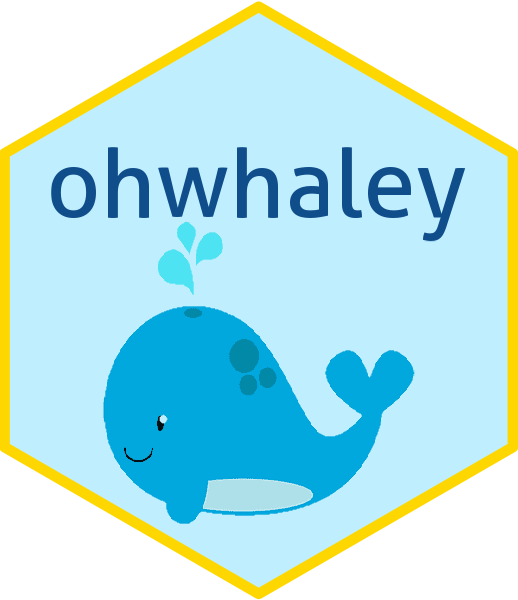

Do you have code that takes a long time to run? Do you want to go do other things and then just get a helpful message when your code is finished, or send messages as progress updates?

Do you want this helpful message to come in the form of a whale pun? Then read on.

## Set up Telegram

First you will need to download the Telegram app on your phone or open it in a web browser. Then, set up your bot using the [botfather](https://telegram.me/botfather). Make sure you give your bot a memorable name!

The botfather will return a html token, copy this and save it somewhere because you will need it for the next steps.

You will also need to install and load the [telegram package](https://cran.r-project.org/web/packages/telegram/index.html) for R.

```{r eval=FALSE, warning = FALSE, message = FALSE}
install.packages("telegram")
library(telegram)
```

Next, create a .Renviron file in your current project directory.

``` bash
touch .Renviron
```

Open this file and add your token from the botfather. The name of your bot should follow the `R_TELEGRAM_BOT_` prefix. This name is also how you will refer to you bot in R code. For our purposes, I've named my bot `ZRRTestBot`.

```         
R_TELEGRAM_BOT_ZRRTestBot=yourtokenhere
```

Finally, you will need to **restart R** in order for the environment variables to load.

## Set up telegram bot in R

Load the telegram library:

```{r}
library(telegram)
```

Then, create the bot object with the `TGBot` function. I am just going to call it `bot` here, but you can call it whatever you'd like.

```{r}
bot<-TGBot$new(token = bot_token("ZRRTestBot")) #make sure this name matches the name you set above in the .Renviron file
```

Check the bot connection. If this matches the name of the bot you set up with the botfather then your setup is correct!

```{r}
bot$getMe()
```

Going back to the botfather, open the link to your bot. Send your bot a message (any message, it doesn't matter what it says).

Check your messages in R:

```{r}
bot$getUpdates()

#see the message you sent
bot$getUpdates()$message$text

#see the chat ID which you will need to save
bot$getUpdates()$message$chat$id
```

Write the chat-ID into your script, since this will not change.

```{r}
bot$set_default_chat_id(7281464972)
```

Now you are ready to send messages in R!

## Send messages to your bot

When you want to send messages from your R script, simply include the following lines of code:

```{r}
library(telegram)
bot<-TGBot$new(token = bot_token("ZRRTestBot")) #make sure this name matches the name you set above in the .Renviron file
bot$set_default_chat_id(7281464972)
```

Then, throughout your script you can send messages using the `sendMessage()` function. The easiest messages to send are text messages:

```{r}
bot$sendMessage("hello world")
```

Intersperse these messages throughout your long-running code, or after code has finished to get updates as your code runs.

But we don't want just any boring updates...

## Use ohwhaley to send fun whale-themed messages

```{r, out.width = "20%", echo = FALSE, fig.align= "center"}

```

[ohwhaley](https://fontikar.github.io/ohwhaley/) is an R package developed by [Fonti Kar](https://fontikar.github.io/) that will print whale-themed messages using the function `say()`

Install `ohwhaley`:

```{r, eval = FALSE}
# install.packages("remotes")
remotes::install_github("fontikar/ohwhaley")
```

Get a fun whale-themed message:

```{r}
library(ohwhaley)
say()
```

To send this message via Telegram you will need to save the output using `capture.output()`. You will also need to collapse it into a single string using `paste()`. `collapse = \n` keeps the line spacing correct so you can still get a whale image in your message. Note that the collapsed message will look weird in your R console but will send nicely to your bot.

```{r, eval = FALSE}
#get say() output
output<-capture.output(say(), type = "message")

#collapse into a single string
output_str<-paste(ouput, collapse = "\n")

#send as message to your bot
bot$sendMessage(output_str)
```

If you want to send a specific message (perhaps about where you are in your code) but you want this to still come with an image of a cute whale, simply add your own text to `say()`:

```{r}
say("Simulation 1 complete")
```

Then, follow the same steps as above to send this to your bot:

```{r, eval = FALSE}
#custom say() output
output<-capture.output(say("Simulation 1 complete"), type = "message")

#collapse into a single string
output_str<-paste(output, collapse = "\n")

#send as message to your bot
bot$sendMessage(output_str)
```

I hope this tip brings you joy as you run those interminable models! Not into whales? Try this with other animals using the [cowsay package](https://github.com/sckott/cowsay).
